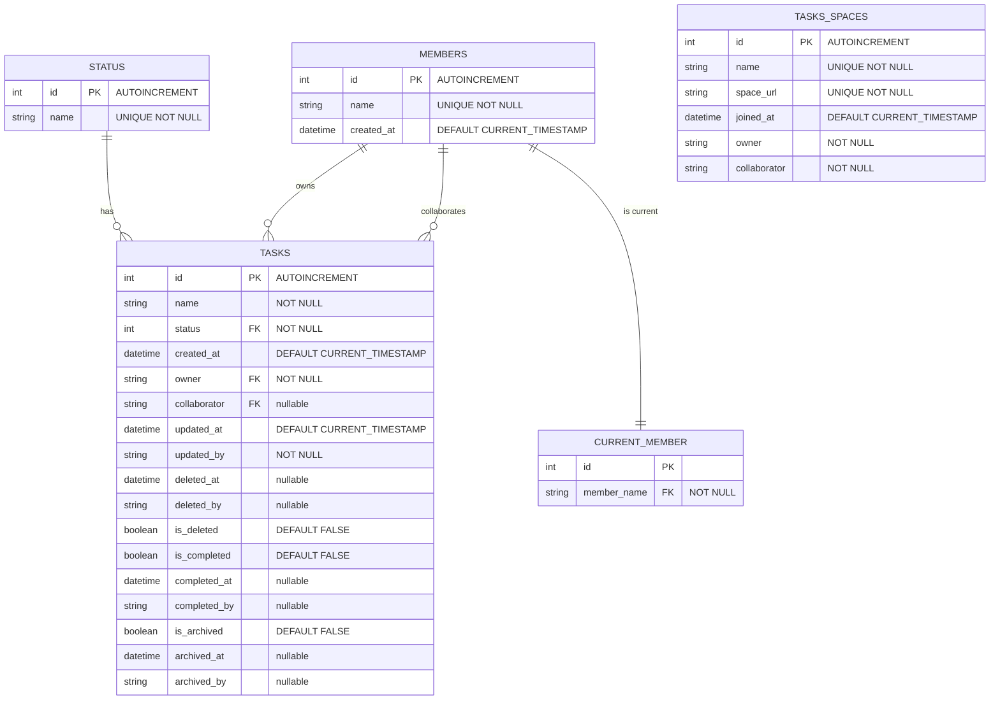

# Database Schema

This document provides a visual representation of the database schema used in the Task CLI application.

## Entity Relationship Diagram

## Schema Description

### STATUS Table
Stores the possible statuses for tasks. Default values include:
- pending
- done

### MEMBERS Table
Stores information about users who can own or collaborate on tasks.

### CURRENT_MEMBER Table
Tracks the currently active user in the system. Only one member can be active at a time.

### TASKS Table
The main table for storing task information. Tasks have an owner and an optional collaborator.
Additional fields track the lifecycle of tasks including completion, deletion, and archiving status.

### TASKS_SPACES Table
Represents task spaces that can be shared between users. Each space has an owner and a collaborator.

## Migration History

The schema evolved through several migrations:

1. **0001_create_task_table.up.sql**: Created the initial STATUS and TASKS tables
2. **0002_create_user_task_space_column.up.sql**: Added the TASKS_SPACES table
3. **0003_update_task_table.up.sql**: Extended the TASKS table with lifecycle tracking fields

The schema also includes MEMBERS and CURRENT_MEMBER tables which are created programmatically through the application code. 